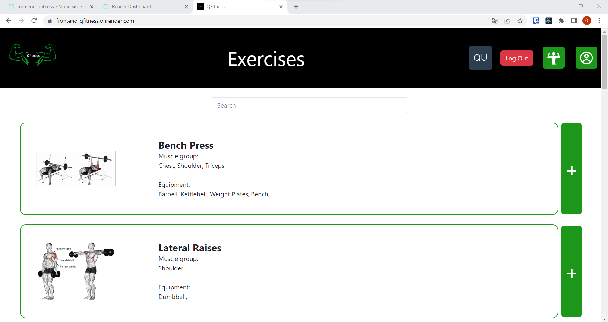
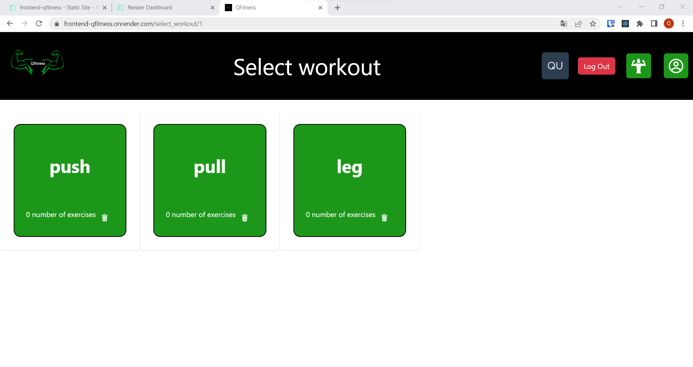
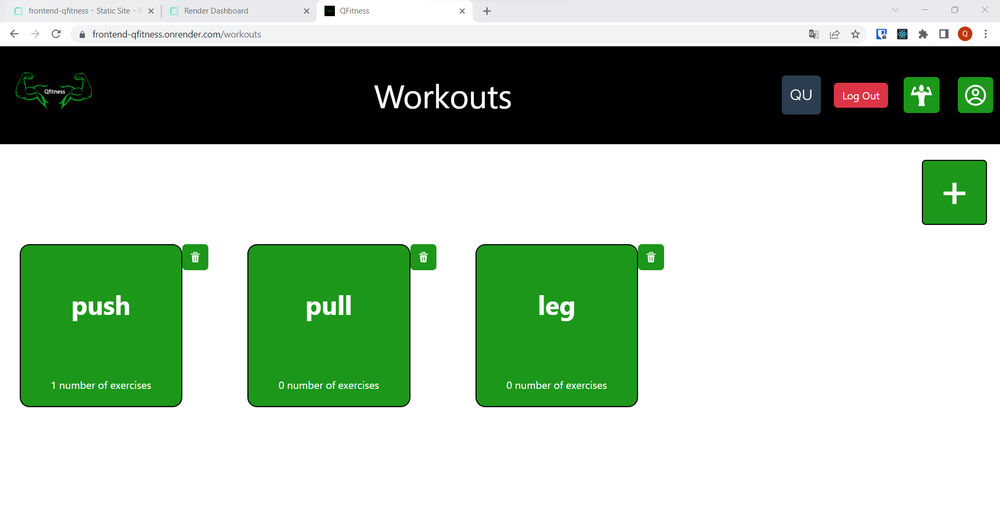
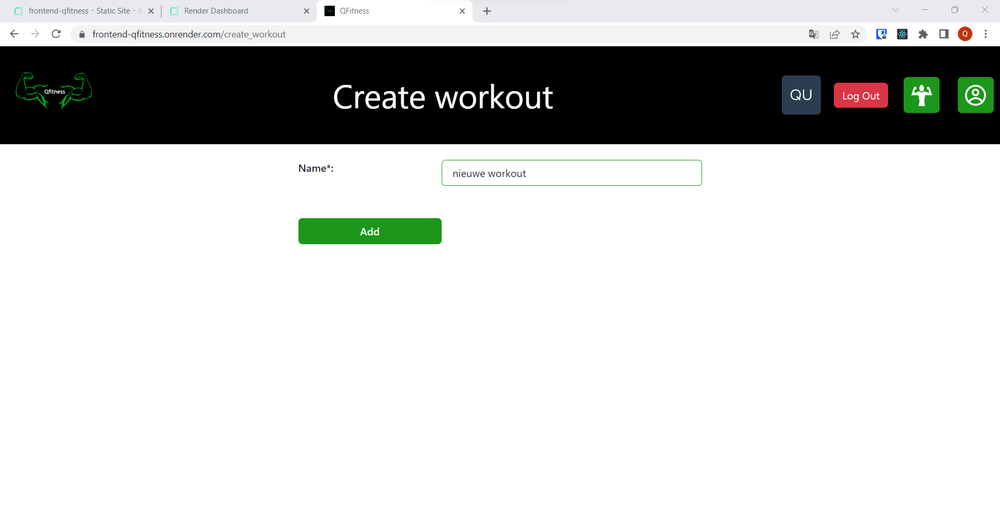
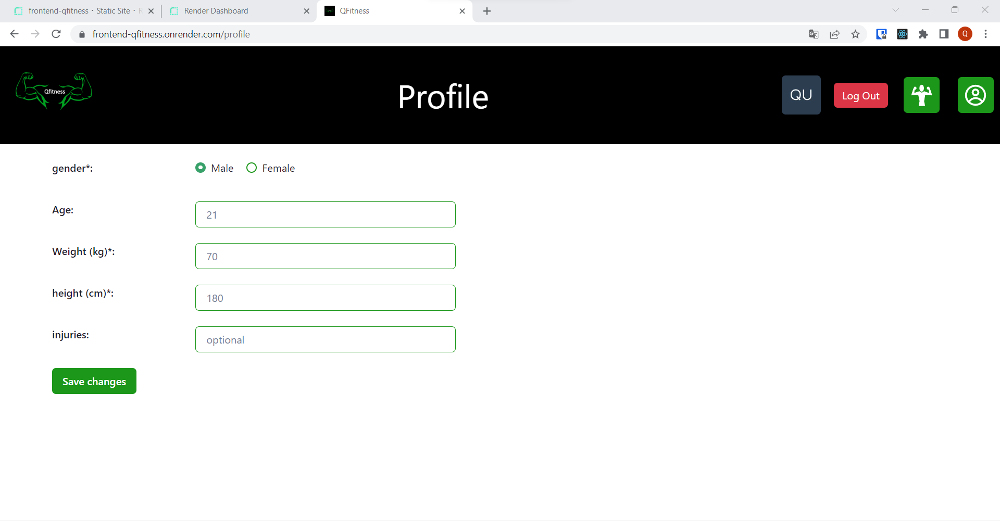

# Quinten Van wiele (202184153)

- [ ] Front-end Web Development
  - [GitHub repository](https://github.com/Web-IV/2223-webservices-pkwiki333)
  - [Online versie](https://frontend-qfitness.onrender.com/)
- [ ] Web Services: GITHUB URL
  - [GitHub repository](https://github.com/Web-IV/2223-frontendweb-pkwiki333)
  - [Online versie](https://webservices-qfitness.onrender.com)

**Logingegevens**

- Gebruikersnaam/e-mailadres: QfitnessProject@gmail.com
- Wachtwoord: QfitnessProjectWachtwoord

## Projectbeschrijving

Mijn project gaat over een fitness applicatie. Hierop kan je verschillende workouts maken en oefeningen in toevoegen, zodat je in de fitness weet wat je moet doen. Het ERD staat in de dossierScreenshot in het project

## Screenshots

door op het plusje rechts van een oefening te drukken, kan je een bestaande workout kiezen en deze oefening daaraan toevoegen.

door op het plusje rechts bovenaan te drukken kan je een nieuwe workout aanmaken. Daarna kan je hem een naam geven en toevoegen.

je kan je profiel aanpassen op de profiel pagina.

om naar je workouts te gaan klik je op de groene knop met het gespierde mannetje in de navigatie balk. Om naar je profielpagina te gaan klik je op het groene profiel logo. Om daarna terug naar alle oefeningen te gaan klik je op het logo links in de navigatie balk.

## Behaalde minimumvereisten

### Front-end Web Development

- **componenten**

  - [x] heeft meerdere componenten - dom & slim (naast login/register)
  - [x] definieert constanten (variabelen, functies en componenten) buiten de component
  - [x] minstens één form met validatie (naast login/register)
  - [x] login systeem (eigen of extern zoals bv. Auth0)
         

- **routing**

  - [x] heeft minstens 2 pagina's (naast login/register)
  - [x] routes worden afgeschermd met authenticatie en autorisatie
         

- **state-management**

  - [x] meerdere API calls (naast login/register)
  - [x] degelijke foutmeldingen indien API call faalt
  - [x] gebruikt useState enkel voor lokale state
  - [ ] gebruikt Context, useReducer, Redux… voor globale state
         

- **hooks**

  - [x] kent het verschil tussen de hooks (useCallback, useEffect…)
  - [x] gebruikt de hooks op de juiste manier
         

- **varia**
  - [ ] een aantal niet-triviale testen (unit en/of e2e en/of ui)
  - [x] minstens één extra technologie
  - [x] duidelijke en volledige README.md
  - [x] volledig en tijdig ingediend dossier

### Web Services

- **datalaag**

  - [x] voldoende complex (meer dan één tabel)
  - [x] één module beheert de connectie + connectie wordt gesloten bij sluiten server
  - [x] heeft migraties
  - [x] heeft seeds
         

- **repositorylaag**

  - [ ] definieert één repository per entiteit (niet voor tussentabellen) - indien van toepassing
  - [ ] mapt OO-rijke data naar relationele tabellen en vice versa
         

- **servicelaag met een zekere complexiteit**

  - [x] bevat alle domeinlogica
  - [ ] bevat geen SQL-queries of databank-gerelateerde code
         

- **REST-laag**

  - [x] meerdere routes met invoervalidatie
  - [x] degelijke foutboodschappen
  - [x] volgt de conventies van een RESTful API
  - [x] bevat geen domeinlogica
  - [x] degelijke authorisatie/authenticatie op alle routes
         

- **varia**
  - [x] een aantal niet-triviale testen (min. 1 controller >=80% coverage)
  - [x] minstens één extra technologie
  - [x] duidelijke en volledige `README.md`
  - [ ] maakt gebruik van de laatste ES6-features (object destructuring, spread operator...)
  - [x] volledig en tijdig ingediend dossier

## Projectstructuur

### Front-end Web Development

Ik heb mijn applicatie getructureerd met behulp van mappen.

### Web Services

> Hoe heb je jouw applicatie gestructureerd (mappen, design patterns...)?

Ik heb met behulp van mappen bijvoorbeeld alles dat met de workouts te maken heeft samen gevoegd in 1 map. Dit heb ik bij een paar dingen gedaan.

## Extra technologie

### Front-end Web Development

Mijn extra technologie is dat ik gebruik heb gemaakt van Chakra UI.
https://www.npmjs.com/package/@chakra-ui/react

### Web Services

Mijn extra technologie is dat ik gebruik heb gemaakt van Prisma.
https://www.npmjs.com/package/prisma

## Testresultaten

### Front-end Web Development

Ik heb testen geschreven die:

- kijkt of de gebruiker alle exercises kan ophalen als hij is ingelogd.
- kijkt of de gebruiker zijn workouts kan ophalen als hij is ingelogd.
- kijkt of de gebruiker een workout kan aanmaken als hij is ingelogd.
- kijkt of de gebruiker zijn gegevens kan bewerken als hij is ingelogd.

### Web Services

Ik heb testen geschreven die:

- alle workouts toont.
- een workout maakt.
- een workout toont door middel van het id.
- een workout update door middel van het id.
- een workout verwijdert door middel van het id.
- alle exercises toont.
- een exercise toont door middel van het id.
- een exercise toont door middel van een zoekterm.

## Gekende bugs

### Front-end Web Development

er zijn geen gekende bugs.

### Web Services

er zijn geen gekende bugs.
